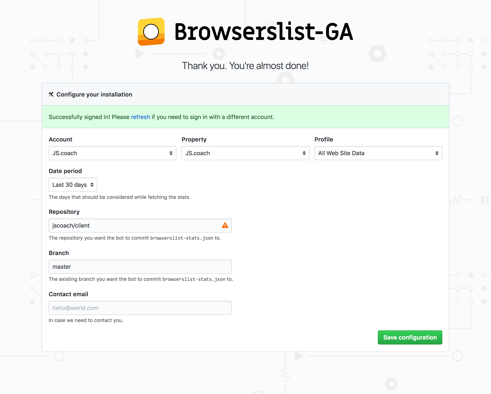

_This is a work in progress and is not fully functional at the moment._

---

The bot only asks for read and write access to a single file
and has no access to the rest of the code in any repository.



---

### Found a bug or have feedback?

Please open an issue in our [GitHub page](https://github.com/dmfrancisco/browserslist-ga-bot).
Pull requests are always welcomed too. Thank you in advance 🙌

### Setting up the server

Install the [`foreman`](https://github.com/ddollar/foreman) gem.
Running `foreman start` will start the database for you and the rails server.
You can run processes individually using `foreman start web` and `foreman start postgresql`.

Credentials and other sensitive information are stored in the `.env` file.
Duplicate the existing `.env.example` file and fill the variables.
To load these variables when you run rails commands, prefix them with `foreman run`.
For example, to start the rails console type the following command:

```shell
foreman run rails c
```

### Additional notes

* If after changing the `.env` file you don't see the changes, run `spring stop`.
* `secrets.yml` replaces newlines with spaces for multiline values, so we aren't using it for the PEM file's content.
